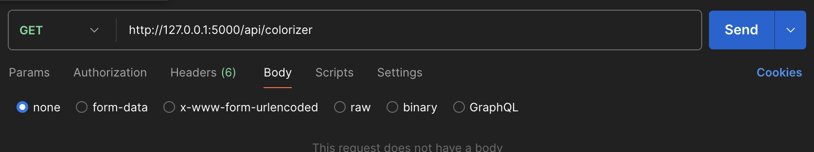
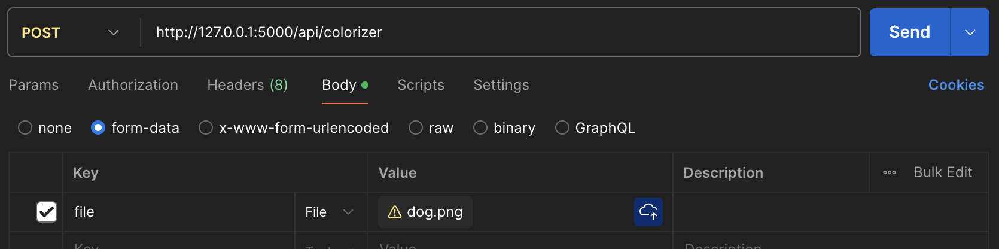

# Photo Colorizer API

## How to start server: 

In your terminal, type:

```flask --app server.py run```

## How to use endpoints:
Base URL: ```http://127.0.0.1:5000```
### GET ```/api/colorizer```:
This endpoint will return instructions on how to use the API.

Example:


### POST ```/api/colorizer```:
Make a POST request via Postman along with a png, jpeg, or jpg image file.
Response will be colorized image.

Example:

